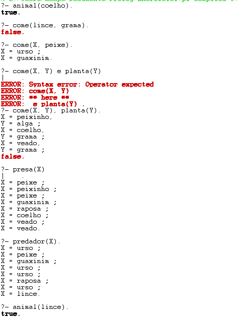
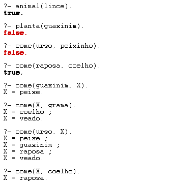

Repositório destinado ao trabalho de Prolog: USANDO PROLOG NA LÓGICA DE PREDICADOS.

O arquivo "Exemplo1.pl" foi um exemplo base utilizado para aprender alguns conceitos básicos utilizados no Prololg, compreender como a linguagem funciona e aprender a sintaxe para as consultas e determinar os fatos.
No arquivo "Exercicio1.pl" contém os fatos e regras pedidos no trabalho.

E aqui está meu trajeto de consultas no terminal do Prolog com o banco de dados do trabalho:

Algumas consultas foram feitas utiliazndo a sintaxe errada por isso apresentaram erro, porém foram corrigidas logo em seguida.
